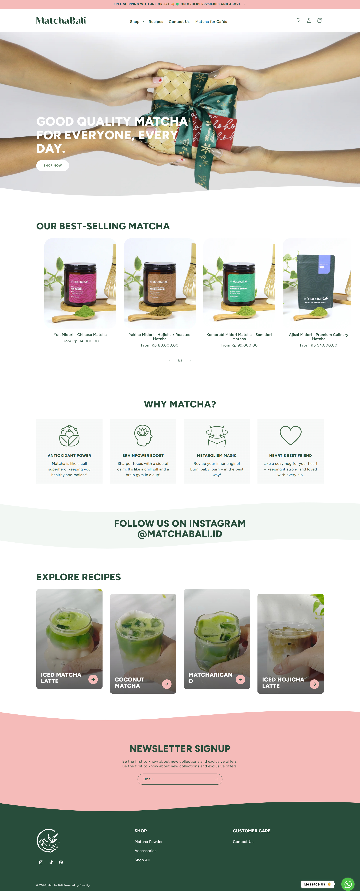

# Machamacha!

[Machamacha!](https://machamacha.thandoyo.com) is an Indonesian brand offering premium, high-quality Japanese matcha and tea-based powdered drinks. Based in Jakarta, they specialize in healthy, instant, and natural products, including matcha lattes, hojicha, and various lattes (sakura, taro, red velvet), available on Tokopedia and Shopee Indonesia.

## Links

- Website/Frontend: <https://machamacha.thandoyo.com>
  - Backend API: <https://machamacha-api.thandoyo.com>
- Repositories:
  - General: <https://github.com/Theofilush/machamacha>
  - Backend API: <https://github.com/Theofilush/machamacha-api>
  - Frontend Web: <https://github.com/Theofilush/machamacha-web>
- Project Management: <https://linear.app/machamacha-online-store>

Inspirations:

- <https://www.matchabali.id> - Discover premium, sustainably sourced matcha from Bali—crafted for daily wellness, rich in flavor, and perfect for your mindful morning ritual. Free shipping on select orders!
- reference:
  - <https://matcha.com> - Internet's official supplier of matcha green tea. Free shipping available. Matcha is the ultimate form of green tea, Matcha(as hot tea or matcha latte) health benefits may include weight-loss, boost antioxidant intake & even promote longevity.
  - <https://www.t2tea.com/en/id> - Let the tea flow with our coveted collection of cups, teapots and more.
  - <https://pasarteh.com> a Complete, Authentic Indonesian Tea Market Place 100% Indonesian tea from several mountains is offered by Pasarteh

## Features

- Home page
  - Home page banner
  - Products catalogue
- Product page
  - Image URL
  - SKU (Stock Keeping Unit)
  - Name
  - Price
  - Description
  - Stock level / In stock or not
  - Add to Cart Form:
    - Quantity Input
    - Increment & Decrement Button
    - Add to Cart Submit Button
- Shopping Cart page
  - Product items to buy
    - Image, name, price, quantity, subtotal (price x quantity)
    - Remove item
    - Change quantity form
  - Link: continue shopping, go to products catalogue
  - Link: checkout
- Checkout page
  - Order summary
    - Product items to buy
    - Grand total of all product items to buy
- Place order / transaction is being processed

## UI Designs

- Figma: <https://www.figma.com/design/DXEMQKyhEZSqkAeQkaAN7B/Machamacha-?node-id=0-1&t=A4RayMMOasc7F00g-1>

### Home Page


### Product by Slug



## Backend REST API Endpoints

- Production: `https://machamacha-api.thandoyo.com`
- Local: `http://localhost:3000`

Priority:

| Endpoint           | HTTP  | Description         | Permission |
| ------------------ | ----- | ------------------- | ---------- |
| `/products`        | `GET` | Get all products    | Public     |
| `/products/{slug}` | `GET` | Get product by slug | Public     |

With Auth:

| Endpoint         | HTTP   | Description              | Permission    |
| ---------------- | ------ | ------------------------ | ------------- |
| `/users`         | `GET`  | Get all users            | Public        |
| `/users/{id}`    | `GET`  | Get user by id           | Public        |
| `/auth/register` | `POST` | Register new user        | Public        |
| `/auth/login`    | `POST` | Login user               | Public        |
| `/auth/me`       | `GET`  | Check authenticated user | Authenticated |
| `/auth/logout`   | `POST` | Logout user              | Authenticated |

Cart:

| Endpoint           | HTTP     | Description                    | Permission    |
| ------------------ | -------- | ------------------------------ | ------------- |
| `/cart`            | `GET`    | Get user's cart                | Authenticated |
| `/cart/items`      | `PUT`    | Add product & quantity to cart | Authenticated |
| `/cart/items/{id}` | `DELETE` | Delete product from cart       | Authenticated |
| `/cart/items/{id}` | `PATCH`  | Update product quantity        | Authenticated |

## Frontend Pages

Priority:

| Route             | Title                    |
| ----------------- | ------------------------ |
| `/`               | Home Page                |
| `/products`       | All Products Page        |
| `/products/:slug` | One Product by Slug Page |

With Auth:

| Route        | Title                   | Permission    |
| ------------ | ----------------------- | ------------- |
| `/register`  | Register Page           | Public        |
| `/login`     | Login Page              | Public        |
| `/dashboard` | Authenticated User Page | Authenticated |
| `/logout`    | Logout Page             | Authenticated |
| `/cart`      | Cart Page               | Authenticated |

## Data Structure

### Product

```json
{
  "id": "ULID123",
  "slug": "premium-culinary-matcha",
  "name": "Ajisai Midori - Premium Culinary Matcha",
  "sku": "MATCHA-1-XXX-2",
  "price": 174000,
  "stockQuantity": 10,
  "imageUrl": "https://uploadcare.com/images/image.jpg",
  "description": "...",
  "createdAt": "...",
  "updatedAt": "..."
}
```

### Add New Product

Request Body:

```json
{
  "name": "Bamboo Tray - Minimal Tea Tray",
  "price": 25000,
  "sku": "BO-TRAY-1",
  "stockQuantity": 10,
  "imageUrl": "https://uploadcare.com/images/image.jpg",
  "description": "..."
}
```

Response Body:

```json
{
  "id": "ULID123",
  "slug": "bamboo-tray",
  "name": "Bamboo Tray - Minimal Tea Tray",
  "price": 25000,
  "sku": "BO-TRAY-1",
  "stockQuantity": 10,
  "imageUrl": "https://uploadcare.com/images/image.jpg",
  "description": "..."
}
```
